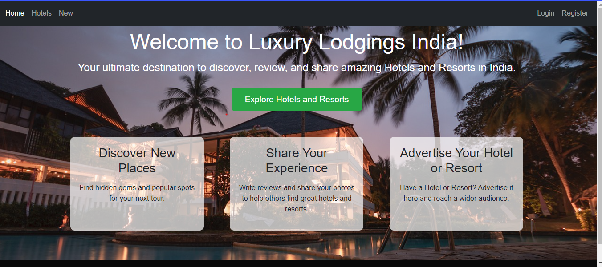
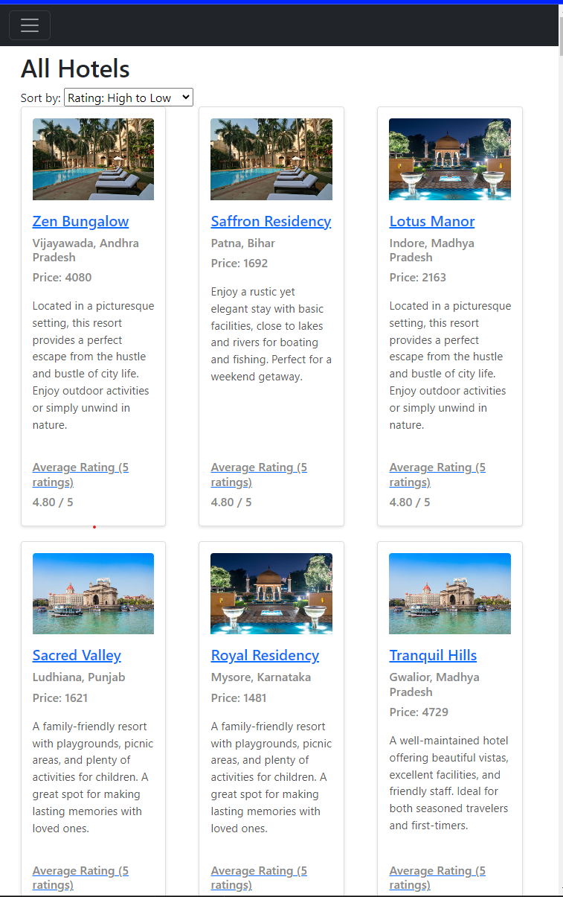
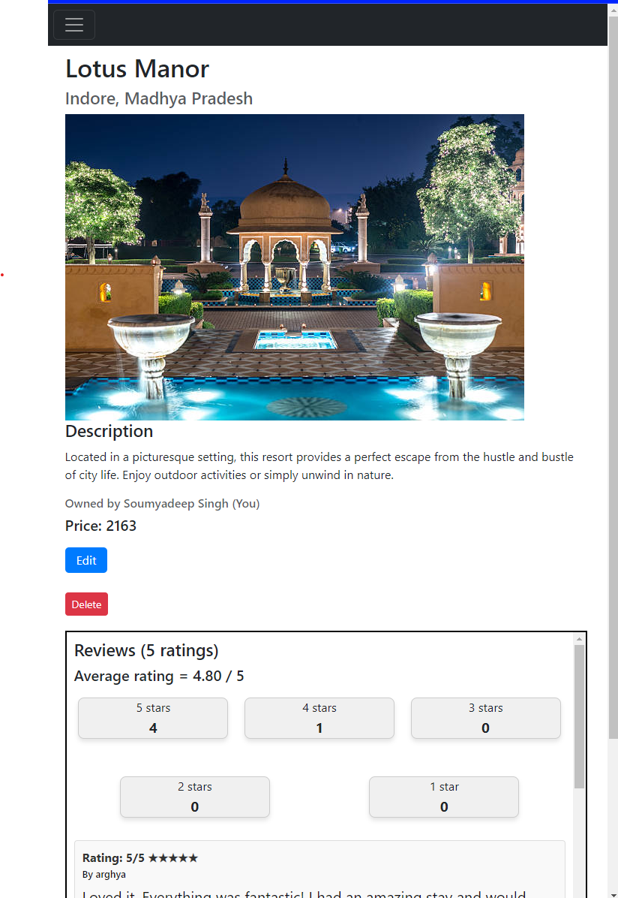
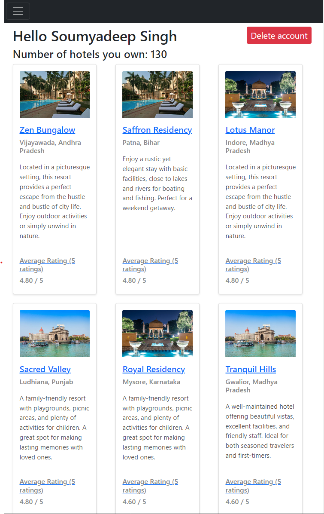
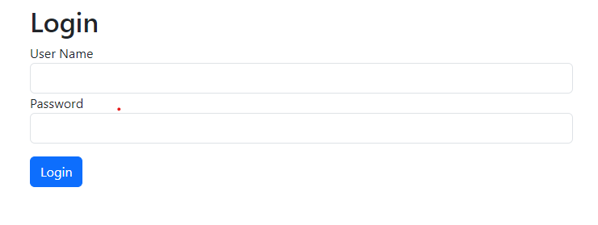
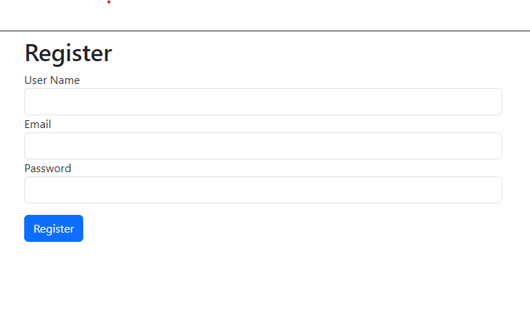

# LuxuryLodgings

LuxuryLodgings is a web application designed to help travelers find the best offers on hotels and resorts across India. Users can browse reviews, compare prices, and make informed decisions. Hotel owners can also advertise their properties, reaching a broader audience and boosting their bookings.

## Preview
Homepage

Details of all hotels

Details and reviews of a hotel

Details on an user activity

Login page for existing users

Register for new users

## Table of Contents
- [Features](#features)
- [Technologies Used](#technologies-used)

## Features

- Browse and search for hotels and resorts across India.
- View detailed information about each hotel, including descriptions, prices, and locations.
- Read and write reviews for hotels.
- Sort hotels by rating, price, and number of reviews.
- Hotel owners can register and advertise their hotels.
- User authentication and authorization.
- Responsive design for mobile and desktop use.

## Technologies Used

- **Frontend**: HTML, CSS, JavaScript, EJS
- **Backend**: Node.js, Express.js
- **Database**: MongoDB
- **Authentication**: Passport.js
- **Templating Engine**: EJS

Thank you for using Luxury-Lodgings-in-India!
